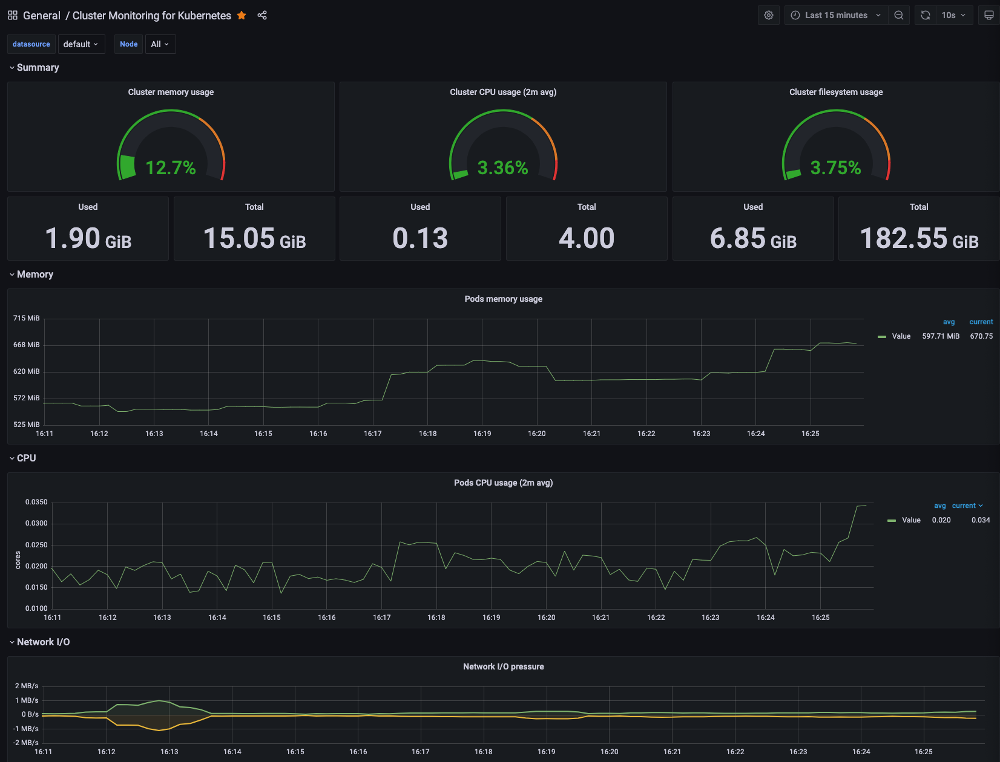

# Background

Horizontal Auto scaling of pods is usually done through HPA leveraging on metrics server. However, there are situation where
scaling needs to be done on external metrics collected through prometheus such as application latency or queue length

# Objective

1. Build a container image that publish metrics to prometheus
2. Use prometheus adapter that extends kubernetes custom metric api
3. Setup HPA to scale with this new custom metric

# Introduction

## What is Prometheus?

Prometheus is an open-source systems monitoring and alerting toolkit originally built at SoundCloud. Since its inception in 2012, many companies and organizations have adopted Prometheus, and the project has a very active developer and user community. It is now a standalone open source project and maintained independently of any company. Prometheus joined the Cloud Native Computing Foundation in 2016 as the second hosted project, after Kubernetes.


## What is Grafana?

Grafana is open source visualization and analytics software. It allows you to query, visualize, alert on, and explore your metrics no matter where they are stored. In plain English, it provides you with tools to turn your time-series database (TSDB) data into beautiful graphs and visualizations.



# Getting started

## 1. Prerequisite


## 2. Create SQS queue with a load generator lambda

## 3. Create EKS cluster with prometheus + grafana

```
# Create EKS Cluster
> . ./sh/01-eks/01-eks-create-cluster.sh

# Create Prometheus metrics server
> . ./sh/02-prometheus/02-create-prometheus.sh

# Create Grafana
> . ./sh/03-grafana/03-create-grafana.sh

# Deploy node-app-metrics service
>. ./sh/04-deploy-service/04-deploy-resource.sh

```

## 2. 


# FAQ

## How does Prometheus know to scrape events from the services that I have launched in my cluster?

The out of the box Kubernetes integration provided by Prometheus has it look at all of the service endpoints in the Kubernetes cluster and look for this annotation, `prometheus.io/scrape: 'true'`

```
# You can see this annotation in action in the following file
> cat sh/04-deploy-service/node-app-service.yaml
```

https://github.com/prometheus-community/helm-charts/tree/main/charts/prometheus